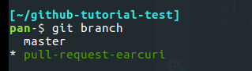
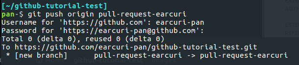
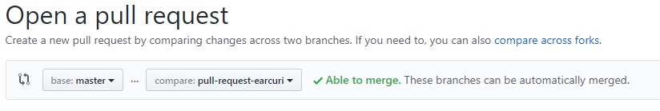
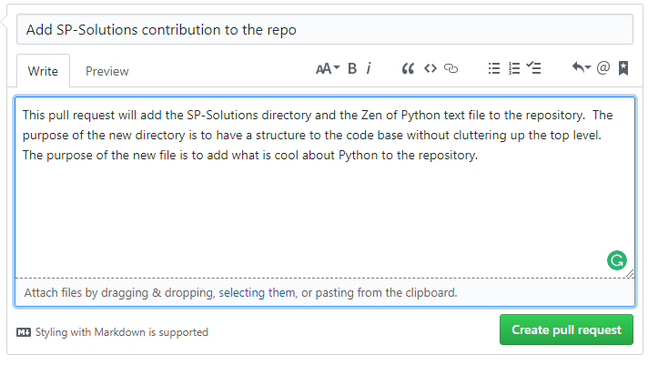

# github-tutorial-test

This is the repository to show off your abilities with Git and GitHub.  

There are two options for executing the test.  The first option is much easier.  However, it is rare that you would work with
open source this way.  The second option is much more "real world" and is how you will deal with open source projects where 
you don't know the maintainers at all.

## Option 1
Send an email to the SP-Solutions team (address is on Page 19 of the tutorial document) with your GitHub userid and the request to
be added as a collaborator on the repository.  Please allow 24 hours for this request to be filled.  

Once you have received an email stating that access has been granted, you can do the following:
1. Clone this repository
2. Create a directory that is your Palo Alto Networks username
3. Add at least 1 text based file to that directory
4. Push your changes back up to this GitHub repository
5. Come back to this repo on GitHub and verify that your directory and file(s) are there. 
  

## Option 2
This option is more involved and is more or less how you would do it with any open source project on GitHub.  This option, however, is more of an intermediate scenario and is not considered basic.    

Pull Requests are commonly used by teams and organizations collaborating using the **Shared Repository Model**, where everyone shares a single repository and topic branches are used to develop features and isolate changes. Many open source projects on Github use pull requests to manage changes from contributors as they are useful in providing a way to notify project maintainers about changes one has made and in initiating code review and general discussion about a set of changes before being merged into the main branch.
To accomplish this you will need to create a branch, stage and commit your changes and then push your branch up to the repository and 
then submit a pull-reqest to have your branch merged with the master branch.  It may seem that this is a "push-request" but what you are actually doing is asking to have your code/text/changes ***pulled*** into the repository by the administrator.

To execute the test this way, you can do the following:
1. Clone this repository and change in the directory
2. Create a new branch by using this command - "*git checkout -b \<branchname\>*"
   ##### In the command above, the branchname can be anything you want.  However, it is good practice to have the branchname be relevant to what you are trying to do.  In this instance a branchname of pull-request-userid (using your GitHub userid) would be best.
3. Issue the command "*git branch*" to verify that you are on the branch you created.

 
4. Create a directory that is your Palo Alto Networks username
5. Add at least 1 text based file to that directory
6. Stage and commit your changes
7. Push your branch up to this repository - "*git push origin pull-request-\<userid\>*"
  
 
8. Come back to this repository on Github and click on the "New Pull Request" button in the repo header.  

 
9. Pick the branch you pushed using the compare dropdown. The base dropdown should be master and  the rest of the fields as is.  You will know that you have done everything correctly if the Able to merge appears.    
  
 
10. Enter a Title and a description for your pull request and hit the "Create pull request" button.
  
 

### You should now see your commit request and it has been submitted to the SP-Solutions team to be merged.  Allow 24 hours for you pull request to be accepted/rejected (with reasons).
You can add comments in the conversation tab if you forgot something and you can look at the "Commits" and "Files changed" tabs to see how GitHub represents the changes you are proposing.  

If you chose Option 2, kudos to you.  This is not easy to understand without doing it a few times.  
